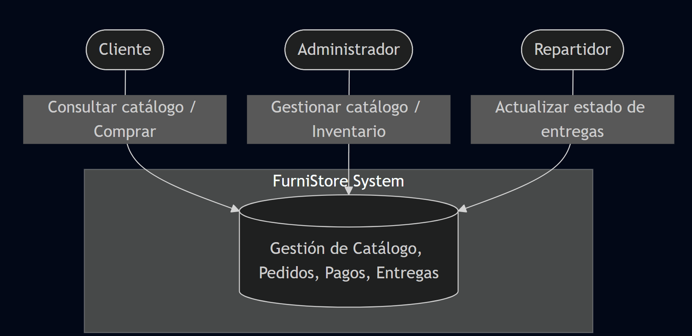
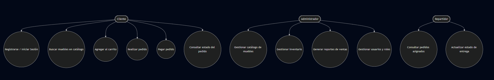
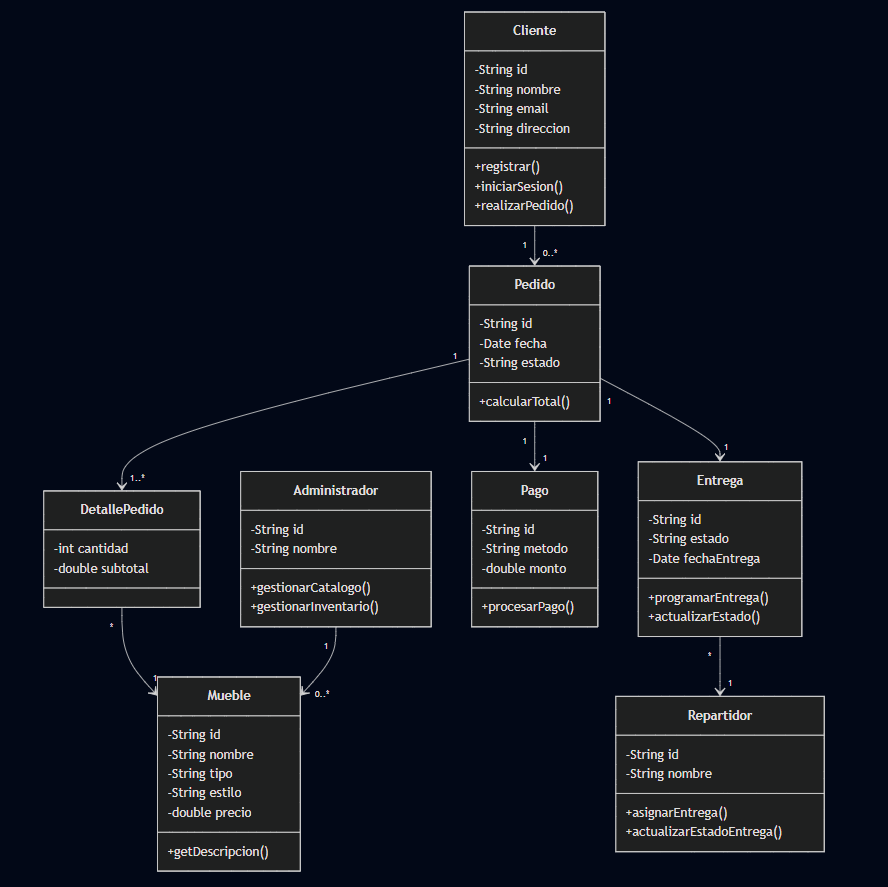

# Taller_refuerzo-CVDS-DOSW-01
Taller refuerzo primer corte

## Hecho por :

- Sebastian Albarracin Silva

---

PRE-REQUISITOS:
- Java OpenJDK Runtime Environment: 17.x.x
- Apache Maven: 3.9.x
- JUnit: 5.x.x
- Git y una cuenta de GitHub
- Docker
- Jacoco
- Sonar Qube
- Lombok 
- Swagguer ui

---

los commits se van a manejar de la siguiente manera:
- feat: para nuevas funcionalidades.
  de esta forma feat(tallerSAS) : descripción del commit

---

# CASO DE ESTUDIO FURNITURE STORE:

# ENUNCIADO

FurniStore es una reconocida tienda de muebles que busca digitalizar toda su operación para mejorar la experiencia de sus clientes. Actualmente, la gestión se hace en hojas de cálculo y facturas manuales, lo que genera errores, demoras en las entregas y falta de trazabilidad.

FurniStore cuenta con diferentes tipos de muebles, como sofas, sillas, sofa camas, camas, etc; manejados en diferentes estilos visuales como lo son los muebles clasicos, modernos, goticos, minimalistas, etc.

La dirección de la empresa ha confiado en usted para diseñar y construir una solución tecnológica robusta, escalable y profesional, aplicando buenas prácticas de ingeniería de software

---

# DIAGRAMACION INICIAL

# 1. Diagrama de contexto con las anotaciones correctas

# 2. Diagrama de Casos de Uso y funcionalidades listadas

# 3. Diagrama de clases preliminar.

# 4. Identificación de patrones de diseño a usar y la razon del porque fundamentado en la academia

## Factory Method / Abstract Factory

Uso: Para la creación de diferentes tipos y estilos de muebles (sofá, silla, cama, clásico, moderno, gótico, minimalista, etc.).

Razón: Según Gamma et al. (1994, Design Patterns), este patrón encapsula la lógica de creación de objetos y permite añadir nuevos productos sin modificar el código existente. De esta forma se cumple el principio Open/Closed de SOLID, garantizando extensibilidad y bajo acoplamiento.

## Strategy

Uso: En la gestión de diferentes métodos de pago (tarjeta, PayPal, contra entrega, transferencia) y en estrategias de cálculo de envío (normal, express, internacional).

Razón: De acuerdo con la teoría de GoF, el patrón Strategy permite definir una familia de algoritmos intercambiables en tiempo de ejecución. Esto elimina condicionales extensos y facilita la mantenibilidad, aplicando el principio de abstracción sobre implementación.

## Observer

Uso: Para notificar a los clientes el estado de sus pedidos y entregas (ejemplo: “Procesando”, “En camino”, “Entregado”).

Razón: Tal como lo plantean GoF (1994), este patrón desacopla los objetos, permitiendo que múltiples suscriptores se actualicen automáticamente cuando cambia el estado de un sujeto. Esto aporta escalabilidad y responde a la necesidad de trazabilidad mencionada en el caso de estudio.

## Singleton

Uso: Para manejar configuraciones globales del sistema (ejemplo: conexión a la base de datos, parámetros centrales de la aplicación).

Razón: Según la literatura académica, el patrón Singleton asegura que exista una sola instancia global de una clase, controlando el acceso a recursos compartidos y críticos, lo cual aporta eficiencia y consistencia en el sistema.

# 5. Justificación de los patrones elegidos y explicación de cómo se cumplen los principios SOLID.

## Factory Method / Abstract Factory

Justificación: En FurniStore existen múltiples tipos de muebles y estilos, por lo que un patrón de creación es esencial para centralizar la construcción de objetos sin acoplar el sistema a clases concretas. Esto facilita la escalabilidad: si mañana se agrega un nuevo tipo de mueble (por ejemplo, "Escritorio"), no será necesario modificar el código existente, solo extenderlo.

Relación con SOLID: Cumple con el principio Open/Closed, ya que las clases están abiertas a la extensión pero cerradas a la modificación.

## Strategy

Justificación: El proceso de pago y de cálculo de envíos son cambiantes y dependen del cliente. Con Strategy se pueden encapsular diferentes algoritmos (pago con tarjeta, PayPal, contra entrega, etc.) y aplicarlos sin modificar el núcleo del sistema. Esto elimina el uso de condicionales y hace que el código sea más limpio y flexible.

Relación con SOLID: Refuerza el principio Dependency Inversion, ya que las clases dependen de interfaces y no de implementaciones concretas. También apoya Open/Closed, al permitir agregar nuevos métodos de pago sin modificar las clases existentes.

## Observer

Justificación: Los clientes necesitan ser notificados automáticamente sobre cambios en sus pedidos y entregas. Con Observer, el sistema de pedidos se convierte en un "sujeto" y los clientes en "observadores", lo que permite mantener un bajo acoplamiento y flexibilidad en la comunicación.

Relación con SOLID: Apoya el principio Single Responsibility, porque la clase Pedido se encarga de gestionar pedidos y no de enviar notificaciones, dejando esa tarea a los observadores.

## Singleton

Justificación: Algunos recursos globales, como la conexión a la base de datos o las configuraciones centrales del sistema, deben tener una sola instancia compartida. Con Singleton, se asegura consistencia en el acceso y control de estos recursos.

Relación con SOLID: Refuerza el principio Single Responsibility, ya que la clase Singleton tiene la única responsabilidad de proveer una instancia global.

